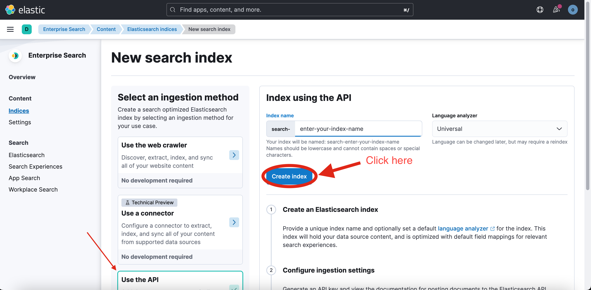

1. Create account or SignIn in https://www.elastic.co.
2. Rename env.example to .env
3. Create deployment.
   
4. Copy credentials and download credentials file.
   
5. Paste password to ELASTIC_PASS= in .env.
6. Wait while elastic nod will be created, then push 'Continue'
   
7. Add integration:
   
8. Select Enterprise search:
   
9. Create an elastic index:
   
10. Enter name of index and create it:
   
11. Create API key:
   
   
12. Download it:
   
13. Go to link 'Elastic search'(1) and copy Cloud ID (2)
   
14. Paste this Cloud ID to ELASTIC_CLOUD_ID in .env
15. Your Elastic configuration is ready.
